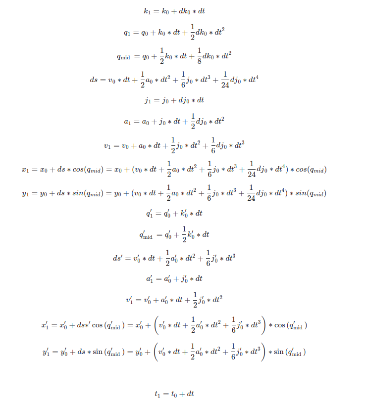
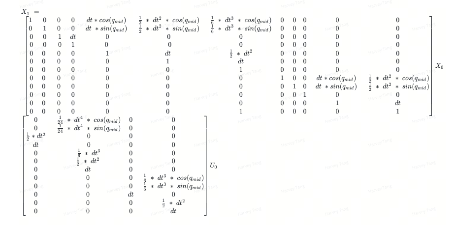
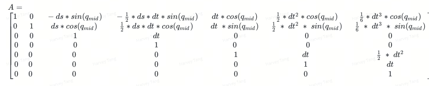
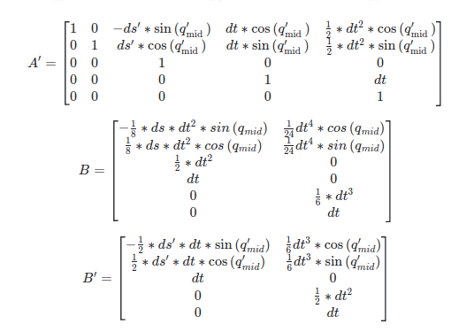
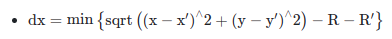
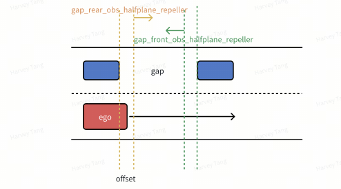

## 时空联合优化

## 1. 优化问题形式

### 1.1 输入

* 自车期望参考轨迹（t_n时刻的状态X，目前不确定是否有整个的参考轨迹即粗解输入）， keyagents预测轨迹

- 场景各障碍物的预测轨迹 (动态/静态)

- 地图信息（车道，目标参考线）

- 交通信号（限速）

### 1.2 输出

- 优化后自车和keyagents各时刻的输入序列U_list

- 对应输入的各时刻的状态X_list

## 2. Spacetime problem 联合优化模型及线性化

交互目标筛选逻辑：选择横向带有BYPASS_LEFT/BYPASS_RIGHT、纵向带有YIELD/OVERTAKE标签的动态障碍物作为联合优化的交互目标。

状态变量 $X = {\left\lbrack  x,y,q,k,v,a,j,{x}^{\prime },{y}^{\prime },{q}^{\prime },{v}^{\prime },{a}^{\prime },{x}^{\prime \prime },{y}^{\prime \prime },{q}^{\prime \prime },{v}^{\prime \prime },{a}^{\prime \prime }...\right\rbrack  }^{T}$ ，其中q是theta，k是角速度控制量 $U = {\left\lbrack  dk,dj,{k}^{\prime },{j}^{\prime },{k}^{\prime \prime },{j}^{\prime \prime }\ldots \right\rbrack  }^{T}$ ;

下面模型只写到两车交互，若有其他交互目标则可继续扩展。 状态空间模型:



离散状态方程:



对各项求偏导, 得到线性化状态方程如下:


其中:





## 3. Spacetime problem potential设计

考虑舒适度代价、目标代价与原来类似，因此安全性（障碍物约束）代价为主要的设计目标。
$$
\begin{aligned}
{l}_{i} = {l}_{i}^{\text{safe }} + {l}_{i}^{\text{tar }} + {l}_{i}^{\text{comf }}
\end{aligned}
$$

### 3.1. 安全性代价 ${l}_{i}^{safe}$

#### 3.1.1. 自车和keyagent建模（三圆盘法）


以距离障碍物最近的圆盘圆心作为实际参与计算的中心坐标。

#### 3.1.2. 障碍物约束
##### 3.1.2.1. PointRepellerWithTime(小型障碍物)

**关键成员变量:**

。 $\mathrm{t}$ : 规划时间点

。 obs_traj：障碍物预测轨迹

。 x_[t]：t时刻障碍物的位置

。 y_[t]：t时刻障碍物的位置

。 buffer_：外圈与内圈之间的缓冲距离

。 radius：内圈的半径

。 gain_：权重(repeller权重)

**Potential:**

。 输入：x[t],y[t]

- 计算两点之间的距离：d= sqrt((x-x_)^2 + (y-y_)^2)

- 到内圈的距离：d_r = max(d - radius, 0)

- 内外圈之间需要关注的距离：res = max(buffer_ - d_r, 0)

- potentai: gain $* {\text{res}}^{2}$

**实现：**

。 新增PointRepellerWithTime类，输入obs预测轨迹和obs参数。通过当前时刻预测轨迹对应的 obs位置，构建PointRepeller并调用当前的PointRepeller进行potential计算。

#### 3.1.2.2. PloygonRepellerWithTime（车辆、行人、自行车等障碍物）

**关键成员变量:**

。 $\mathrm{t}$ : 规划时间点

。 obs_traj：障碍物预测轨迹

。 gain_：权重

。 $\mathsf{{poly}}\_ \left\lbrack  \mathsf{t}\right\rbrack$ ：t时刻预测的障碍物多边形（line_segment_ptrs_ $\left\lbrack  \mathsf{t}\right\rbrack$ 组成多边形的线段） 

**Potential:**

。 输入：x[t]，y[t]

。 输出：

- 判断点是否在多边形内，若在：计算点到边界（取点到line_segment_ptrs_[t][i]中距离最小值）的距离dx, potential $=$ gain $* d{x}^{2}$

- 若不在多边形内部：potential = 0

**实现:**

。 新增PloygonRepellerWithTime类，输入obs预测轨迹和obs参数。通过当前时刻预测轨迹对应的obs位置，构建obs_ploygon并进行potential计算。

#### 3.1.2.3. HalfplanePloylineRepeller(栏杆、实线、道路边界)

**关键成员变量:**

。 line_segment_ptrs_：多段线中的线段，类型为vector<LineSegmentSquareDistance>

。 line_segment_num_

。 flag：判断可行的半平面

。 gain_：权重

直线方程：nx_[i] * x_ + ny_[i] * y_ +b_[i] = 0

**Potential:**

。 输入：x[t],y[t]

。 输出：

- 判断点是否在可行半平面内，若不在：计算点到边界（取边界线段距离最小值）的距离dx， potential  $=$  gain  $* d{x}^{2}$

- 若在内部：potential = 0

### 3.2. 目标参考代价 ${l}_{i}^{\text{tar }}$ (reference)

#### 3.2.1. 自车目标参考代价

##### 3.2.1.1. 最终期望位置/角度attractor
```cpp
std::vector<PointAttractor> point_attractors;
std::vector<AngleAttractor> angle_attractors;
```

**关键成员变量:**

。 x_N: 自车的最终期望位置

。 y_N:

。 q_N: 自车的最终期望角度

。 gain_: 权重

**Potential:**

。 输入：x[t],y[t]

。 输出：potential = gain_p * ((x-x_N)^2 + (y-y_N)^2) + gain_q*(q-q_N)^2

##### 3.2.1.2. 参考轨迹attractor（若没有参考轨迹，则考虑引入和目标参考线相关的  attractor)
```cpp
std::vector<GenericSmoothAttractor2D*> pos_attractors;
std::vector<GenericSmoothAttractor1D*> theta_attractors;
std::vector<GenericSmoothAttractor1D*> kappa_attractors;
std::vector<GenericSmoothAttractor1D*> vel_attractors;
std::vector<GenericSmoothAttractor1D*> acc_attractors;
std::vector<GenericSmoothAttractor1D*> jrk_attractors;
```

与上面的最终位置吸引设计类似（考虑具体时刻的轨迹点）。

**关键成员变量:**

。 x_[t]、y_[t]、q_[t]、k_[t]、v_[t]、a_[t]、j_[t]

。 gain_: 权重

**Potential:**

。 输入：x[t],y[t],q[t],k,[t] ,v,[t],a,[t],j,[t]

。 输出：potential = gain*加权平方和

##### 3.2.1.3. smooth_polyline_attractors/smooth_angle_attractors对目标参考线的位 置/角度跟随（只考虑路径）
```cpp
std::vector<SmoothPolylineAttractor> smooth_polyline_attractors;
std::vector<SmoothAngleAttractor> smooth_angle_attractors;
```

**关键成员变量:**

。 gain_: 权重

。 offset_potentials_
。 line_segment_ptrs_: 多段线中的线段，类型为vector<LineSegmentSquareDistance>

。 line_segment_num_

**Potential:**

。 输入：x,y

。 输出:

计算点(x，y)到多段线的最小距离dx以及对应线段的指向误差dq：

。 potentials = gain_*(w_p*dx^2+w_q*dq^2)

#### 3.2.2. keyagent目标参考代价

##### 3.2.2.1. 预测轨迹attractor
```cpp
std::vector<GenericSmoothAttractor2D*> pos_attractors;
std::vector<GenericSmoothAttractor1D*> theta_attractors;
std::vector<GenericSmoothAttractor1D*> vel_attractors;
std::vector<GenericSmoothAttractor1D*> acc_attractors;
```
keyagent的目标参考只引入与预测轨迹相关的attractor，初步想法是赋予较高的权重，暗示人类驾驶员往往不愿意目前的驾驶策略。

**关键成员变量:**

。 x',[t]、y',[t]、q'_[t]、v'_[t]、a'_[t]

。 gain_：权重

**Potential:**

。 输入：x'[t],y'[t],q'[t],v'[t],a'[t]

。 输出：potential = gain*加权平方和

PS:

对于自车和keyagent参考轨迹potential，考虑到联合状态，预计将其合并为对联合轨迹的attractor；
```cpp
std::vector<CombineTrajAttractor> combine_traj_attractors;
```
### 3.3. 舒适度代价 ${l}_{i}^{\text{comf }}$

```cpp
std::vector<GenericSmoothRepeller1D*> pos_repellers;
std::vector<GenericSmoothRepeller1D*> vel_repellers;
std::vector<GenericSmoothRepeller1D*> acc_repellers;
std::vector<GenericSmoothRepeller1D*> jerk_repellers;
std::vector<GenericSmoothRepeller1D*> kappa_repellers;
std::vector<GenericRepeller1D*> limit_vel_repellers;
std::vector<GenericRepeller1D*> limit_lateral_acc_repellers;
std::vector<GenericRepeller1D*> limit_acc_repellers;
std::vector<GenericRepeller1D*> limit_jerk_repellers;
```

#### 3.3.1. 速度、角速度、加速度等限制
```cpp
std::vector<GenericRepeller1D*> limit_vel_repellers;
std::vector<GenericRepeller1D*> limit_acc_repellers;
std::vector<GenericRepeller1D*> limit_jerk_repellers;
std::vector<GenericRepeller1D*> limit_kappa_repellers;
std::vector<GenericRepeller1D*> limit_lateral_acc_repellers;
```
**关键成员变量:**

。 gain_：权重

。 sign_: 符号

。 x_: 状态量

**Potential:**

。 输入：x

。 输出：gain_ * (max(sign_ * (x - x_), 0))^2

进一步，转向相关的舒适度代价还应该考虑速度的作用（高速和低速下转动相同角度的方向，带来的舒适度代价应该是不同的），后续看看是否需要继续展开设计。

### 3.4. 决策标签相关potential (采用半平面repeller实现)

#### 3.4.1. halfplane_repeller

**关键成员变量:**

。 obs_center[t]：keyagent前轴中心

。 lane_heading: 当前车道朝向

。 flag: 判断可行的半平面

。 gain_: 权重

。 利用obs_center和lane_heading可以计算得到当前半平面（垂直于车道）直线方程为：


$$
\mathrm{y} - \mathrm{y}0 = \tan \left( {\mathrm{q} + \mathrm{{pi}}/2}\right)  * \left( {\mathrm{x} - \mathrm{x}0}\right)
$$


其中x0,y0是obs中心，q是车道朝向

**Potential:**

。 输入：x[t],y[t]

。 输出:

- 判断点是否在可行半平面内，若不在：依次计算自车三圆盘模型三个圆心点到边界直线的距离，并取最大值dx，potential = ${gain} * d{x}^{2}$

- 若在内部：potential = 0


#### 3.4.2. 纵向overtake标签 ego_overtake_halfplane_repeller

对于overtake标签的obs，自车受到向前的一个半平面repeller


#### 3.4.3. 纵向yield标签 ego_yield_halfplane_repeller

和overtake标签类似, 不过此时自车受到向后的一个半平面repeller;


#### 3.4.4. 横向bypass标签

(TODO)

### 3.5. 自车与keyagents交互相关potential

#### 3.5.1. 碰撞约束

(直接用两车距离计算)

**关键成员变量:**

。 gain_：权重

。 buffer_: 缓冲距离

**Potential:**

。 输入：x,y,x',y'

- 通过两车三圆盘模型, 依次计算两车三个圆盘之间的两两距离



- d_r = max(buffer_ - dx, 0)

。 输出：potential = gain_* d_r ^ 2

- 需要注意，对于这个potential求偏导时，需要对x,y,x',y'依次进行。

#### 3.5.2. 决策标签交互相关potential（采用半平面repeller实现）

##### 3.5.2.1. 纵向overtake标签

**(1) 自车ego_overtake_halfplane_repeller**

对于overtake标签的keyagent，自车受到向前的一个半平面repeller


**(2) keyagent keyagent_overtake_halfplane_repeller**

keyagent考虑ego具体行为，即自车未出现明显变道举动时不受到影响，ego切入后keyagent受到 repeller作用

**关键成员变量:**

。 obs_center[t]：自车后轴前轴中心

。 lane_heading: 当前车道朝向

。 flag: 判断可行的半平面

。 gain_: 权重

。 利用obs_center和lane_heading可以计算得到当前半平面（垂直于车道）直线方程为：

$$
\text{y'-y0=tan(q+pi/2) * (x'-x0)}
$$

其中x0,y0是obs中心，q是车道朝向

**Potential:**

。 输入：x'[t],y'[t]

。 输出：

- 判断自车是否已经变道切入，若ego还未切入: potential = 0 ;
- 判断点是否在可行半平面内，若在内部：potential = 0 ;
- 若不在：依次计算自车三圆盘模型三个圆心点到边界直线的距离，并取最大值dx，potential = gain $* d{x}^{2}$


##### 3.5.2.2. 纵向yield标签

和overtake标签类似，不过此时自车受到向后的一个半平面repeller，keyagent受到向前的半平面 repeller；另一方面，由于自车已经完成让行决策，因此不需要等到keyagent压线后才施加repeller作用。


##### 3.5.2.3. 横向bypass标签

（TODO）

### 3.6. 多决策变道相关

#### 3.6.1. gap相关potential

##### 3.6.1.1. gap_front_obs_halfplane_repeller/gap_rear_obs_halfplane_repeller 

**关键成员变量:**

。 obs_center[t]：前车后轴中心/后车前轴中心

。 lane_heading: 当前车道朝向

。 flag: 判断可行的半平面

。 gain_：权重

。 利用obs_center和lane_heading可以计算得到当前半平面（垂直于车道）直线方程为：

$$
\text{y-y0=tan(q+pi/2) * (x-x0) }
$$

其中x0,y0是obs中心，q是车道朝向

**Potential:**

。 输入：x[t],y[t]

。 输出:

- 判断点是否在可行半平面内，若不在：依次计算自车三圆盘模型三个圆心点到边界直线的距离，并取最大值dx，potential = ${gain} * d{x}^{2}$

- 若在内部：potential = 0



##### 3.6.1.2. gap_state_attractor

（对gap vt的跟踪，初步考虑只跟踪gap速度）
```cpp
std::vector<GenericSmoothAttractor1D*> gap_vel_attractors;
```

## 4. 流程图


## 5. 路测效果

| cut-in场景 | [1.mp4](./case/1.mp4) |
| :-- | :-- |
| 多目标交互绕行 | [2.mp4](./case/2.mp4) |
| 过弯、路口 | [3.mp4](./case/3.mp4) |
| 跟轨迹行驶 | [4.mp4](./case/4.mp4)  |